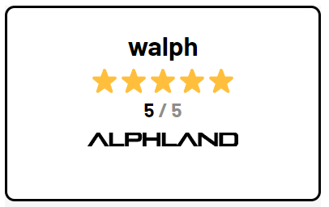

<div align="center">
    
    <h4>The home for all projects in the Alephium ecosystem</h4>

</div>


## 🧭 Explore the Alephium ecosystem

Visit <a href="https://alph.land"><b>alph.land</b></a> to explore the most influential dapps in the Alephium
ecosystem.

To use them, download the <a href="https://github.com/alephium/desktop-wallet"><b>Alephium Desktop Wallet</b></a> or use
the Alephium Wallet Browser Extension for Chrome or Firefox:

<div align="center">
    <a href="https://chromewebstore.google.com/detail/alephium-extension-wallet/gdokollfhmnbfckbobkdbakhilldkhcj?pli=1">
        
    </a>
    <a href="https://addons.mozilla.org/de/firefox/addon/alephiumextensionwallet/">
        
    </a>
</div>

## ✅ Add your project to Alphland

If you are building on Alephium and want to showcase it in Alphland, you just need to submit a PR to this
repository.

Steps:

1. Create your images: 320x320 logo, 1920x400 banner and 700x400 preview. Use
   the <a href="https://www.figma.com/file/6S69MxzfC99Sn6VxhqVuYL/Alphland-Figma-Template?type=design&node-id=0-1&mode=design&t=9k544zGf8bbibA5E-0">
   Alphland Figma template</a> to help you.
2. Please optimise your images using tinypng.com – JPGs are best for photos and PNGs for graphics. Or you can convert to
   WebP.
3. Fork this repo and create a new folder with your project name under `/public/dapps/`
4. Add your optimised images to the folder
5. Copy [`dapp_data_example.json`](https://github.com/Cojodi/alphland/blob/develop/dapp_data_example.json), rename it
   with your project's name in lowercase and move it to `/data`
6. Fill out the fields in the json file with your project's data
7. Ensure the json points to your images, i.e.

```
  "media": {
    "logoUrl": "/dapps/yourdapp/yourdapp-logo.png",
    "bannerUrl": "/dapps/yourdapp/yourdapp-banner.png",
    "previewUrl": "/dapps/yourdapp/yourdapp-preview.png",
    … etc
  }
```

8. Rename ```env.example``` to ```env.local```, ```npm run build``` and check if your project is displayed correctly.
9. Create the PR if above steps succeeded.

And that's it! 🚀

Someone from the Alphland team will review the PR and contact you if they need to clarify anything.

## Maintainers
This repo is maintained by [Fugashu](https://github.com/Fugashu) and [msMatix](https://github.com/msMatix).

For any questions either create an issue on this repo or find us on the Alephium Discord:

<a href="https://discord.gg/3y8HvQ97s4">
  
</a>

## 📣 Share your project rating with the world

Embed the Alphland rating widget in your application!



#### Using the widget

```
<a href="https://www.alph.land/{your_dapp_name}" style="display:inline-block;position:relative">
  <div style="position:absolute;top:0;right:0;bottom:0;left:0;"></div>
  <iframe src="https://www.alph.land/widgets/rating?dappname={your_dapp_name}" width="260" height="176" frameBorder="0" title="Alphland Widget"></iframe>
</a>
```

1. Copy and paste the snippet above
2. In `<a href="…">` change `your_dapp_name` to exactly the same as the name of your project as shown in your Alphland url.
3. Also change `your_dapp_name` in the `<iframe src="…">`
4. (Optional) you can also set the theme to `theme=light` or `theme=dark` 😎 (default uses the device settings).  
   Just add the `theme` param to the url after your dappname.
5. That's it!

#### Widget example

walph on Alphland would be `https://www.alph.land/walph`

[View example on CodeSandbox](https://codesandbox.io/p/sandbox/github/codesandbox-app/static-template/tree/master/?layout=%257B%2522sidebarPanel%2522%253A%2522EXPLORER%2522%252C%2522rootPanelGroup%2522%253A%257B%2522direction%2522%253A%2522horizontal%2522%252C%2522contentType%2522%253A%2522UNKNOWN%2522%252C%2522type%2522%253A%2522PANEL_GROUP%2522%252C%2522id%2522%253A%2522ROOT_LAYOUT%2522%252C%2522panels%2522%253A%255B%257B%2522type%2522%253A%2522PANEL_GROUP%2522%252C%2522contentType%2522%253A%2522UNKNOWN%2522%252C%2522direction%2522%253A%2522vertical%2522%252C%2522id%2522%253A%2522clq7stizt0006356r45i8d0a6%2522%252C%2522sizes%2522%253A%255B70%252C30%255D%252C%2522panels%2522%253A%255B%257B%2522type%2522%253A%2522PANEL_GROUP%2522%252C%2522contentType%2522%253A%2522EDITOR%2522%252C%2522direction%2522%253A%2522horizontal%2522%252C%2522id%2522%253A%2522EDITOR%2522%252C%2522panels%2522%253A%255B%257B%2522type%2522%253A%2522PANEL%2522%252C%2522contentType%2522%253A%2522EDITOR%2522%252C%2522id%2522%253A%2522clq7stizt0002356ri1lvafm2%2522%257D%255D%257D%252C%257B%2522type%2522%253A%2522PANEL_GROUP%2522%252C%2522contentType%2522%253A%2522SHELLS%2522%252C%2522direction%2522%253A%2522horizontal%2522%252C%2522id%2522%253A%2522SHELLS%2522%252C%2522panels%2522%253A%255B%257B%2522type%2522%253A%2522PANEL%2522%252C%2522contentType%2522%253A%2522SHELLS%2522%252C%2522id%2522%253A%2522clq7stizt0003356rkb1fwhde%2522%257D%255D%252C%2522sizes%2522%253A%255B100%255D%257D%255D%257D%252C%257B%2522type%2522%253A%2522PANEL_GROUP%2522%252C%2522contentType%2522%253A%2522DEVTOOLS%2522%252C%2522direction%2522%253A%2522vertical%2522%252C%2522id%2522%253A%2522DEVTOOLS%2522%252C%2522panels%2522%253A%255B%257B%2522type%2522%253A%2522PANEL%2522%252C%2522contentType%2522%253A%2522DEVTOOLS%2522%252C%2522id%2522%253A%2522clq7stizt0005356ref4immgf%2522%257D%255D%252C%2522sizes%2522%253A%255B100%255D%257D%255D%252C%2522sizes%2522%253A%255B50%252C50%255D%257D%252C%2522tabbedPanels%2522%253A%257B%2522clq7stizt0002356ri1lvafm2%2522%253A%257B%2522tabs%2522%253A%255B%257B%2522id%2522%253A%2522clq7stizt0001356r9drk3o3v%2522%252C%2522mode%2522%253A%2522permanent%2522%252C%2522type%2522%253A%2522FILE%2522%252C%2522filepath%2522%253A%2522%252Findex.html%2522%252C%2522state%2522%253A%2522IDLE%2522%252C%2522initialSelections%2522%253A%255B%257B%2522startLineNumber%2522%253A6%252C%2522startColumn%2522%253A60%252C%2522endLineNumber%2522%253A6%252C%2522endColumn%2522%253A60%257D%255D%257D%255D%252C%2522id%2522%253A%2522clq7stizt0002356ri1lvafm2%2522%252C%2522activeTabId%2522%253A%2522clq7stizt0001356r9drk3o3v%2522%257D%252C%2522clq7stizt0005356ref4immgf%2522%253A%257B%2522tabs%2522%253A%255B%257B%2522id%2522%253A%2522clq7stizt0004356rd4h3r8x9%2522%252C%2522mode%2522%253A%2522permanent%2522%252C%2522type%2522%253A%2522UNASSIGNED_PORT%2522%252C%2522port%2522%253A0%252C%2522path%2522%253A%2522%252F%2522%257D%255D%252C%2522id%2522%253A%2522clq7stizt0005356ref4immgf%2522%252C%2522activeTabId%2522%253A%2522clq7stizt0004356rd4h3r8x9%2522%257D%252C%2522clq7stizt0003356rkb1fwhde%2522%253A%257B%2522tabs%2522%253A%255B%255D%252C%2522id%2522%253A%2522clq7stizt0003356rkb1fwhde%2522%257D%257D%252C%2522showDevtools%2522%253Atrue%252C%2522showShells%2522%253Atrue%252C%2522showSidebar%2522%253Atrue%252C%2522sidebarPanelSize%2522%253A15%257D)

```
<a href="https://www.alph.land/walph" style="display:inline-block;position:relative">
  <div style="position:absolute;top:0;right:0;bottom:0;left:0;"></div>
  <iframe src="https://www.alph.land/widgets/rating?dappname=walph" width="260" height="170" frameBorder="0" title="Alphland Widget"></iframe>
</a>
```

## Donations

Fuel our code with caffeine! If you'd like to sponsor a coffee for our project, you can donate to our ALPH wallet address below. Every sip powers our progress! 🚀☕
```
16uJvxtaSkuKEz3DEzCKHsemE4LWvnqZS1WrSAhoeL9Fr
```
## Acknowledgments

Special thanks to [Argentlabs](https://github.com/argentlabs/dappland). We're deeply grateful for their work, which laid the groundwork for this project.

We are immensely grateful to [Alephium](https://alephium.org/) and the [Blockflow Alliance DAO](https://twitter.com/Blockflow_DAO) for their generous support and sponsorship of this project.

For more information about our sponsors:
<div align="center">
<a href="https://alephium.org/">

</a>

<a href="https://twitter.com/Blockflow_DAO">
    
</a>
</div>

